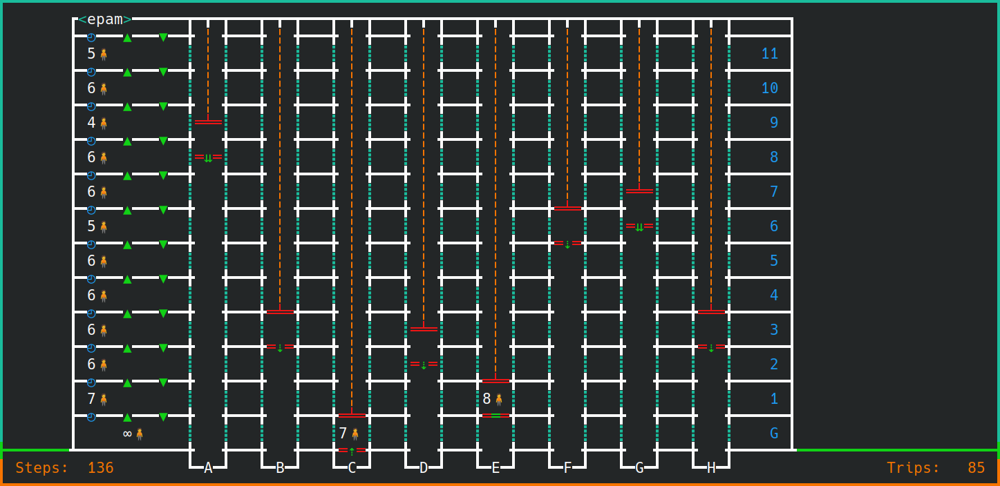

# Next Level Abstraction

[](https://raw.githubusercontent.com/nagyesta/next-level-abstraction/main/LICENSE)


### Useful links:
- [EPAM Debrecen Java Community](https://community-z.com/communities/debrecen-java-community)
- [EPAM Debrecen Offers for Students](https://community-z.com/communities/debrecenmeetsyou/offers-for-students)

## About this project

This project is an educational aid. It models a simplistic world with an office building that contains floors and elevators.

A number of people are arriving to work and leaving after work, following a number of scripted behaviors (arriving early or late, going out
for lunch etc.).

The exercise challenges you to find an optimal control program for the elevators in the building in order to transport people to their
destinations. Depending on your definition of optimal, it can be using:
- the least amount of turns (as an approximation of time) spent waiting;
- the least amount of turns spent traveling; or
- the least moves performed by the elevators (conserving energy). 
  
Good luck finding the right level of abstraction for modeling the behavior of people in order to let your elevators serve them best!

## Presentation files

- Complete: [Step Into Next Level Abstraction 2021.pdf](.github/assets/Step%20Into%20Next%20Level%20Abstraction%202021.pdf)

## Hall of Fame

[See here](Hall-of-Fame.md)

## Running the app

### Note
Although the application can work on Windows, you will most probably not see the UTF-8 characters the same way as on Unix.

### Example

```./gradlew run -P appSpeed=insane -P size=tiny -P controller=custom```

### Parameters

#### appSpeed

- `insane` - Max FPS.
- `ultra-fast` - Minimal wait times, impossible to follow.
- `fast` - Bit faster than normal.
- `default` - Reasonably fast animation.
- `slow` - Reduced speed to let you see what happens.
- `ultra-slow` - Painfully slow. 

#### size
- `tiny` - Tiny building for small businesses.
- `large` - Large, crowded commercial building.
- `empty` - Large office with low utilization.

#### controller
- `monkeys` - This would happen if you had infinite amount of monkeys hitting infinite amount of keyboards to write an elevator controller.
- `shortcuts` - Assuming that you tried the `monkeys` method, but some were particularly smart.
- `buttons` - Elevators are actually listening to the will of the people. They go to floors where people are waiting and react to the
  buttons pressed in the elevator.
- `balanced` - Load balanced variant of `buttons`, meaning that the controller will only send one elevator car for people waiting on a
  floor.
- `custom` - Whatever you decide to write in [CustomElevatorController](src/main/java/com/github/nagyesta/demo/nla/state/control/CustomElevatorController.java)
